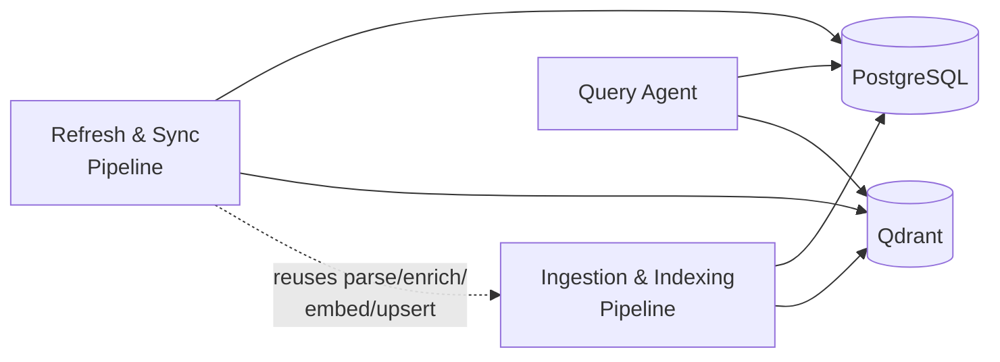

# mnrva

mnrva is a retrieval-augmented system for querying a codebase in natural language - "how is auth implemented?", answered by an agent that actually reads and cites your code.

It indexes a git repository into structure-aware, context-enriched chunks, answers developer questions through a corrective-RAG agent, and efficiently keeps the index in sync as the codebase moves forward.

## Screenshots

<p align="center">
   
   
</p>

## Architecture

mnrva is three components sharing Qdrant and PostgreSQL as their only
integration points:



- **Ingestion & Indexing Pipeline** - clones a repo, parses every git-tracked file (using tree-sitter for code and format-aware splitters for
prose/config), enriches chunks with LLM-generated context in batched calls, embeds them, and upserts into Qdrant as a producer/consumer pipeline sized to the account's rate limits. Runs once per repo via `mnrva-ingest`.
- **Query Agent** - a LangGraph agent implementing corrective RAG: hybrid (dense + BM25) search via Qdrant's native `prefetch` + RRF fusion, a relevance-grading step, answer generation with real chunk citations, and
an answer-quality check that can loop back to re-retrieve with a revised
query. Conversation state persists in Postgres via LangGraph's
checkpointer, so a follow-up question can continue from a different
process. Served over FastAPI + SSE, with a React/Vite chat client.
- **Refresh & Sync Pipeline** - on a schedule, diffs the tracked repo's
current commit against its remote HEAD, and re-runs ingestion's
parse/enrich/embed/upsert path only for what changed. Cost scales with
the diff, never with total repo size. Ships as a reusable GitHub Actions
workflow (`mnrva-refresh`) or can be run manually using `mnrva-refresh`.

Full design docs live in [`docs/`](./docs), starting with
[`docs/architecture.md`](./docs/architecture.md).

## Prerequisites
- Docker
- An OpenAI API key
- A public GitHub repository to index

## Installation & Running

1. Clone the repository:
   ```
   git clone https://github.com/NaorGavriel/mnrva.git
   cd mnrva
   ```
2. Create a `.env` file in the project root:
   ```
   cp .env.example .env
   ```
   Fill in the variables.
3. Build and start PostgreSQL, Qdrant, the API, and the frontend:
   ```
   docker compose up -d --build
   ```
4. Ingest a repository (one-time, per repo):
   ```
   docker compose run --rm ingest <github_url>
   ```
5. Open the chat client at `http://localhost:5173` and start asking
   questions about the ingested repository.

To pick up changes pushed to the tracked repo's `origin` without a full
re-ingest:
```
docker compose run --rm sync
```
To run it on a schedule instead of manually, copy
[`docs/mnrva-refresh.yml`](./docs/mnrva-refresh.yml) into your own repo's
`.github/workflows/` — see that file's header comments and
[`docs/refresh_sync_pipeline.md`](./docs/refresh_sync_pipeline.md) for
setup.

## Environment variables
See [`.env.example`](./.env.example) for a fillable template.

## Features

- Structure-aware chunking via tree-sitter (Python, TypeScript/TSX,
  JavaScript/JSX), classes and functions/methods at any depth, linked
  through `parent_id`
- Format-aware chunking for prose/config (`.md`, `.json`, `.toml`,
  `.ini`/`.cfg`, `.txt`).
- LLM-enriched chunk context, batched per file to minimize redundant calls
- Corrective RAG: per-chunk relevance grading, answer-quality evaluation,
  and a bounded re-retrieval loop with a revised query.
- Multi-turn conversation with real citations (file, line range, and
  quoted excerpt), persisted in Postgres via LangGraph's checkpointer.
- Incremental refresh that re-indexes only changed files, deployable as a
  reusable, schedulable GitHub Actions workflow

## Usage

1. Ingest the repository you want to query: `docker compose run --rm ingest <github_url>`.
2. Start the app (see above) and open the chat client at `http://localhost:5173`.
3. Write a question and pick an effort level (`basic` / `medium` / `high`) -
   effort controls the retry cap on the retrieve/grade/generate/evaluate
   loop.
4. Read the answer and its citations; follow-up questions reuse the same
   `thread_id` and fold the prior turn into context.
5. Keep the index current by running `docker compose run --rm sync` (locally)
   manually, or scheduling it via the reusable GitHub Actions workflow (cloud).

## Constraints

- Public repositories only.
- Single repository per Qdrant collection.

## Documentation

- [`docs/architecture.md`](./docs/architecture.md) - full system design
- [`docs/ingest_index_pipeline.md`](./docs/ingest_index_pipeline.md)
- [`docs/query_agent.md`](./docs/query_agent.md)
- [`docs/query_agent_api_frontend.md`](./docs/query_agent_api_frontend.md)
- [`docs/refresh_sync_pipeline.md`](./docs/refresh_sync_pipeline.md)
