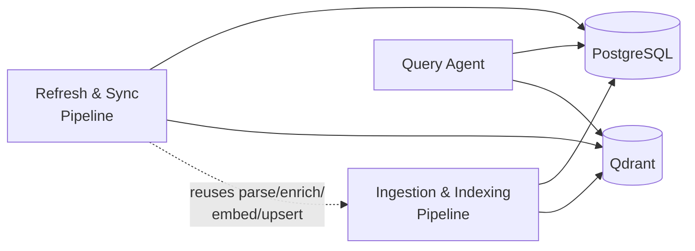
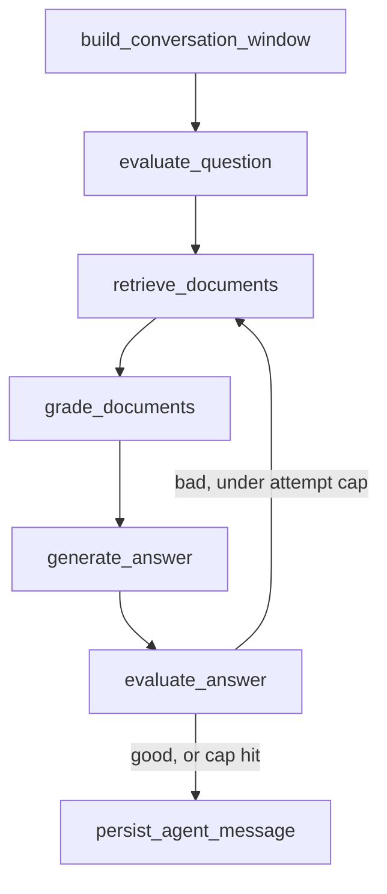

# mnrva - Development & Architecture Document

## 1. Overview

A retrieval-augmented system for querying a code repository in natural language
(e.g. "how is auth implemented?"). The system indexes a codebase into
structure-aware, context-enriched chunks, answers developer queries through a
corrective-RAG agent, and keeps the index in sync as the codebase changes.

Primary goal: structure-aware chunking, contextual retrieval, and
corrective (retrieve/grade/generate/evaluate) retrieval - applied to the
source code domain.

## 2. System Components

The system is organized into three components, sharing Qdrant and
PostgreSQL as their only integration points:

### 2.1 Ingestion & Indexing Pipeline

Responsible for turning raw repository files into searchable, enriched chunks.
Runs as a producer/consumer pipeline so throughput scales with repo size under a shared, account-level rate budget.

1. **Parse phase.** Walk every wanted file (git-tracked, extension-allowlisted,
   filename-denylisted, oversize-cutoff-filtered). Route each to the
   correct tree-sitter grammar by file extension (see §3.3) and extract
   classes first, then functions/methods at any depth (linked to their
   enclosing class via `parent_id`), plus imports, via a per-language
   node-type query; non-code files are chunked instead via format-aware
   splitters (markdown headers, JSON keys, TOML/INI sections, or paragraph
   splitting), never tree-sitter. No LLM calls in this phase. All parsed
   files feed a repo-wide file queue.
2. **Enrichment workers.** A bounded pool of workers pulls files off that
   queue. Each worker enriches a file's chunks in one batched,
   structured-output LLM call (the file source/imports sent once, covering
   all of that file's chunks, to avoid re-sending the file per chunk);
   large files are split into sequential sub-batch calls. 
   Calls are paced through a shared async token-bucket
   rate limiter (requests/minute and tokens/minute), sized from the
   account's actual limits rather than hardcoded. A file already durably
   upserted from a prior run is skipped.
   Enriched chunks are pushed onto a second, ready-to-embed queue.
3. **Embedding consumer.** Drains the ready-to-embed queue, accumulating
   chunks *across files* until a full embedding-batch is available (or the
   enrichment side signals it's fully drained),
   then embeds and upserts the whole batch in one call each. Embedding calls share the same rate limiter as enrichment, since both draw from the same account-level budget.

A batch becoming durable in Qdrant is the pipeline's recovery unit: a crash
only loses whatever hadn't yet been embedded/upserted, and re-parsing on
restart is cheap since it's local and LLM-free. A file's `content_hash`
(stored in chunk payload) lets a later run skip re-parsing/re-enriching
files that haven't changed since the last upsert.

Chunk IDs are derived from `path + kind + class_name + symbol_name`, formatted as a UUID (`uuid5`). The mapping stays deterministic which is what lets the refresh pipeline (§2.3) do a clean delete-and-replace on re-index.

Ingestion also seeds the repo's `github_url`/`commit_sha` into Postgres
(§3.5) — the record the refresh pipeline updates and the query agent reads.

Full design: `docs/ingest_index_pipeline.md`.

### 2.2 Query Agent

Handles developer-facing natural language queries against an
already-ingested repository, as a LangGraph agent implementing corrective
RAG: a fixed retrieve → grade → generate → evaluate pipeline with one
loop-back edge for re-retrieval.

- **`evaluate_question`** turns the raw question into a `synthesized_query`
  plus retrieval `filters` (currently `language`).
- **`retrieve_documents`** runs **hybrid search** — dense vector similarity
  + BM25 keyword search over chunks, combined server-side by Qdrant's Query
  API (`prefetch` + `FusionQuery(fusion=RRF)`). Vector search catches
  conceptual matches; BM25 catches exact identifier/error-string matches.
  Native to Qdrant.
- **`grade_documents`** labels each newly-retrieved chunk relevant or not;
  only `yes`-labeled chunks reach `generate_answer`.
- **`evaluate_answer`** grades the generated answer against the *original*
  question. If marked `bad`, loops back to `retrieve_documents` with a revised `search_query` if under the retry cap. If marked `good`, or cap hit, moves on.
- **`build_conversation_window`** (start of the *next* turn) folds the
  previous turn's question/answer/cited-chunks into a bounded
  `conversation_window`.

Conversation state — the full agent state, including `messages` and
`conversation_window` — persists in Postgres (§3.5) via LangGraph's
checkpointer, keyed by a per-conversation `thread_id`. Full design: `docs/query_agent.md`.

A thin FastAPI + SSE layer and a React/Vite chat
client sit on top of the compiled graph - one endpoint per
turn, streamed node-by-node. Full design: `docs/query_agent_api_frontend.md`.

### 2.3 Refresh & Sync Pipeline

Keeps the Qdrant index and Postgres's repo metadata consistent with the
tracked repo's `origin` as it moves forward, without a full re-ingest.
Reuses (1)'s parse/enrich/embed/upsert functions per changed file rather
than re-deriving them; cost scales with what changed, never with total
repo size.

1. **No-op check** — compare the stored `commit_sha` against the remote's HEAD sha.
2. **Partial clone** — a fresh, disposable clone (commit/tree history only, no working tree, never persisted between runs), keeping cost independent of repo size.
3. **Diff** — running `git diff` between the old and new sha to get a list of the changed   file paths.
4. **Fetch & parse changed content** — one `git archive` call at the new
   sha for every changed path's content.
5. **Delete then insert** — chunks for every deleted *and* changed
   `file_path` are purged before any upsert, changed files are
   re-parsed, re-enriched, re-embedded, and re-inserted via the same
   enrich/embed/upsert path ingestion uses. Chunk ID determinism (§2.1) is
   what makes this a clean delete-and-replace.

`commit_sha` only advances in Postgres once every changed path applies
successfully; a failed run leaves it untouched
Full design: `docs/refresh_sync_pipeline.md`.

## 3. System Architecture

### 3.1 Language

- Python
- TypeScript

### 3.2 Libraries & Frameworks

- **LangChain** — agent orchestration for the query agent.
- **tree-sitter** — AST-aware chunking. One grammar package per supported
  language (see §3.3).

### 3.3 Multi-language support

The codebase is not assumed to be single-language. Routing and extraction
are language-specific:

| File extension | Grammar package | Notes |
|---|---|---|
| `.py` | `tree_sitter_python` | `function_definition`, `class_definition` |
| `.ts`, `.tsx` | `tree_sitter_typescript` | `function_declaration`, `class_declaration`, `interface_declaration`, plus arrow functions assigned via `variable_declarator` |
| `.js`, `.jsx` | `tree_sitter_javascript` | same arrow-function caveat as TypeScript |

Each language has its own node-type query, maintained as a small per-language config.

A `language` field is stored in chunk metadata, enabling language-scoped
filtering or boosting at query time.

### 3.4 Vector store

**Qdrant** covers every embedding-adjacent need.

- **Vectors** — dense embeddings for semantic search.
- **Sparse vectors** — Qdrant generates BM25 sparse vectors natively for the lexical half of hybrid search.
- **Payload** — chunk metadata (`file_path`, `kind`, `class_name`,
  `symbol_name`, `parent_id`, `start_line`, `end_line`, `language`,
  `content_hash`) plus `raw_text`/`context_text` (the enriched text used
  for both embedding and BM25 indexing, returned directly on search hits)
  stored per point, with indexed fields for fast filtering (e.g.
  language-scoped search).
- **Fusion** — dense + sparse results are combined server-side via the
  Query API's built-in RRF.

### 3.5 Conversation & repo-state store

**PostgreSQL** holds everything that isn't a vector: LangGraph conversation
checkpoints and repo metadata - seeded by ingestion (§2.1) and kept current
by the refresh pipeline (§2.3). Full design: `docs/query_agent.md`.