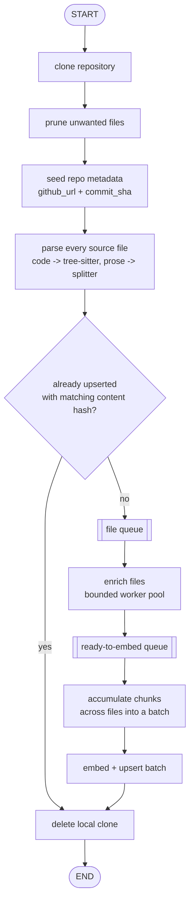

# Ingestion & Indexing Pipeline Component

Component 1 (`docs/architecture.md` §2.1). Turns a repository's `github_url`
into searchable, enriched chunks in Qdrant. Runs once per repo via the
`mnrva-ingest` CLI; its enrich/embed/upsert core is reused by the refresh
pipeline (`docs/refresh_sync_pipeline.md`), and `chunks.py`'s search
functions by the query agent (`docs/query_agent.md`).

## Flow

A batch becoming durable in Qdrant is the pipeline's recovery unit: if
anything raises before cleanup, the scratch clone is left on disk for
inspection, and re-parsing on restart is cheap since it's local and
LLM-free. `repo_metadata` is written to Postgres before parsing starts, so
a failed run still leaves a resolvable `github_url`/`commit_sha` for a
future resync.

## Modules

- **Clone & file selection** (`repository_clone.py`,
  `repository_parser.py`) — shallow `git clone`, then prune to git-tracked
  files passing an extension allowlist (`languages.py`'s `LANGUAGE_CONFIG`
  plus prose extensions) minus a lockfile denylist and an oversize cutoff.
  `repository_parser.py` only decides; `repository_clone.py` is the only
  thing that touches disk. The scratch clone (`repository_files/`) is
  wiped before every run and deleted only after a successful upsert.

- **Code parsing** (`models.py`, `languages.py`, `registry.py`,
  `code_parser.py`) — tree-sitter, one grammar per language. Two passes
  per file: classes first, then functions/methods at any depth, linked to
  their enclosing class via `parent_id`. Chunk ids are
  `uuid5(path + kind + class_name + symbol_name)` — deterministic and
  content-independent, so refresh can upsert by id instead of
  search-then-delete.

- **Prose parsing** (`prose_parser.py`) — non-code files (`.md`, `.json`,
  `.toml`, `.ini`/`.cfg`, `.txt`) are chunked by format-aware splitters
  (markdown headers, JSON keys, TOML/INI sections, or paragraph
  splitting), never tree-sitter.

- **Enrichment** (`enrichment.py`) — one batched, structured-output LLM
  call per file, not per chunk: the file's source/imports are sent once,
  covering every chunk. Missing/invalid entries in the response are
  retried at a smaller scope; still-missing chunks are logged and left
  unenriched rather than failing the file.

- **Embedding** (`embeddings.py`) — batches `chunk_retrieval_text`
  (enrichment context + raw text) into one embeddings call per batch.

- **Rate limiting** (`rate_limiter.py`) — a shared async token-bucket
  limiter (requests/min + tokens/min) gates every enrichment and embedding
  call, since both draw from the same OpenAI account-level budget.

- **Storage** (`db/db_qdrant.py`, `chunks.py`) — one Qdrant collection
  with a named dense vector and a named BM25 sparse vector generated
  server-side at upsert time. The `content_hash` stored in each chunk's
  payload is what lets a later run skip chunks that haven't changed.

- **Orchestration** (`repository_ingester.py`) — `ingest_repository`
  composes all of the above as a producer/consumer pipeline: the parse
  phase feeds a file queue, a bounded pool of enrichment workers drains it
  into a ready-to-embed queue, and one embedding consumer accumulates
  chunks across files until a full batch is ready, then embeds and
  upserts it.

## Non-obvious decisions

- The skip check compares `content_hash` per file, not per chunk — one
  changed chunk re-enriches the whole file.
- `chunk_retrieval_text` (context + raw text) is shared by dense embedding
  and BM25 indexing, so both halves of hybrid search see identical content
  for the same chunk.
- JS/TS named arrow functions (`const f = () => {}`) are chunked by
  falling back to the enclosing `variable_declarator`'s name, since the
  arrow function node itself has no name.

## Constraints 

- No private-repo/auth support.
- Enrichment latency is still the dominant cost end to end.

## Deployment

`mnrva-ingest <github_url>` — env-driven config (`QDRANT_URL`/
`QDRANT_API_KEY`, `POSTGRES_*`, `OPENAI_API_KEY`), same convention as
`mnrva-refresh`. One-shot and manually triggered.
`mnrva-refresh` is what runs on a schedule after the initial load.
