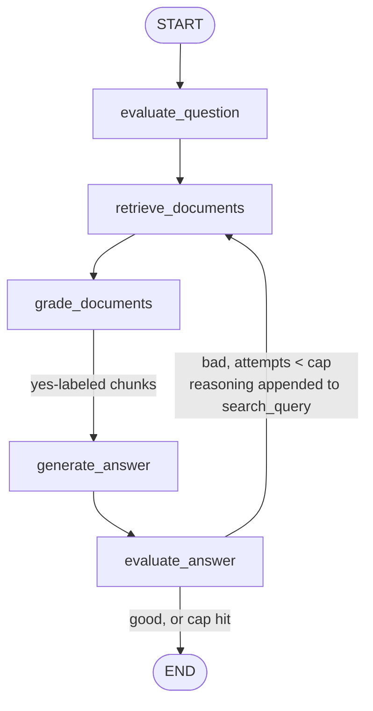

# Query Agent Component

Component 2 (`docs/architecture.md` §2.2). A LangGraph agent that answers
natural-language questions about one already-ingested repository.

Scope: single repo per Qdrant collection, multi-turn conversation.
Corrective-RAG pipeline: fixed retrieve → grade → generate → evaluate
stages, with one loop-back edge for re-retrieval.

## Graph



## Nodes

All LLM nodes run on `AGENT_MODEL` (env var).

1. **`evaluate_question`** (LLM, structured output) — reasons about the
   question: implementation, architecture, a heuristic/design decision, a
   specific named symbol, or a workflow. Produces `synthesized_query`
   (question + any added context — this, not the raw question, is what
   gets searched), `filters` (`language`/`kind`), and
   `expects_multiple_retrievals` — computed but currently unused by any
   edge.

2. **`retrieve_documents`** (not an LLM call) — calls `search_chunks`
   (§2.1) with `search_query` + `filters`. Hits merge into
   `retrieved_chunks`, keyed by chunk id, so a chunk returned by more
   than one attempt doesn't duplicate.

3. **`grade_documents`** (LLM, structured output, one call per
   newly-retrieved chunk) — labels each chunk not yet graded `yes`/`no`
   for relevance to the user's question. Labels persist across attempts;
   a chunk is graded once.

4. **`generate_answer`** (LLM, structured output) — question +
   `yes`-labeled chunks → `Answer` (§2.2).

5. **`evaluate_answer`** (LLM, structured output) — grades the generated
   `Answer` against the *original user question* (not the retrieved
   chunks against the search query — a distinct judgment from
   `grade_documents`'s per-chunk relevance). `good` → END. `bad`, under
   the attempt cap → loops back to `retrieve_documents` with the
   evaluator's reasoning appended to `search_query` (additive, doesn't
   replace `synthesized_query`/`filters`). `bad`, cap hit → END anyway,
   answer stands.

## Edges

1. `START → evaluate_question`
2. `evaluate_question → retrieve_documents`
3. `retrieve_documents → grade_documents`
4. `grade_documents → generate_answer`
5. `generate_answer → evaluate_answer`
6. `evaluate_answer → retrieve_documents` — `bad` and `retrieval_attempts < cap`
7. `evaluate_answer → END` — `good`, or cap hit

## 2.1 Retrieval

- **`search_chunks`** (`chunks.py`) — called directly by
  `retrieve_documents`, not agent-invoked. Uses Qdrant's Query API:
  `prefetch=[Prefetch(query=embed_text(query_text), using=DENSE_VECTOR_NAME), Prefetch(query=Document(text=query_text, model="Qdrant/bm25"), using=SPARSE_VECTOR_NAME)]`,
  `query=FusionQuery(fusion=Fusion.RRF)`, optional `Filter` on
  `language`/`kind`. Returns payload + score per hit — `file_path`,
  `symbol_name`, `class_name`, `kind`, `start_byte`, `end_byte`,
  `raw_text`, `context_text`, `score`.

  Cross-file context comes from re-running `search_chunks`
  on the `evaluate_answer → retrieve_documents` loop-back edge.

## 2.2 Conversation & agent state

LangGraph's Postgres checkpointer persists all of `AgentState` per
`thread_id`. `thread_id` scopes *conversation* history only.
`agent_messages.py` is a thin wrapper handing back a configured
`PostgresSaver` over `db_postgres.py`'s connection.

```python
class AgentState(TypedDict):
    messages: Annotated[list[AnyMessage], add_messages]
    search_query: str
    search_filters: dict  # {"language": str}
    expects_multiple_retrievals: bool
    retrieved_chunks: Annotated[dict[str, ChunkSearchResult], merge_by_key]  # keyed by chunk id
    chunk_relevance: dict[str, Literal["yes", "no"]]  # keyed by chunk id
    retrieval_attempts: int
    answer: Answer | None
    answer_grade: Literal["good", "bad"] | None
    evaluation_reasoning: str | None
```

`retrieved_chunks` needs a custom merge reducer (parallel to
`add_messages` on `messages`) — LangGraph's default TypedDict field
semantics overwrite on each node return, which would drop everything
from prior attempts.

`Answer = {text: str, citations: list[Citation]}`. `Citation =
{file_path, start_line, end_line, citation_text}` — `citation_text` is
the quoted source excerpt itself (code or prose), not just its location.

## 2.3 Life-cycle

1. Caller starts a conversation with some `thread_id`, against some
   already-running agent process.
2. The graph runs `evaluate_question → retrieve_documents →
   grade_documents → generate_answer → evaluate_answer` once,
   correcting via re-retrieval (up to the attempt cap) if the answer
   grades bad.
3. Postgres checkpoints `AgentState` under `thread_id` — visible to any
   process handling a follow-up on that `thread_id`, not just the one
   that handled turn 1.
4. Follow-up turn, possibly on a different process: prior state restored
   from Postgres.

## 2.4 Constraints

- **`retrieval_attempts` cap** — flat cap enforced in `graph.py`
  (`RETRIEVAL_ATTEMPTS_CAP`).

## 2.5 Decisions & reasoning (recap)

- **`raw_text`/`context_text` added to the Qdrant payload** — makes a
  search hit self-contained.
- **Repo metadata and conversation state in Postgres, not Qdrant** —
  Qdrant stays a pure vector/payload store; Postgres is the
  system-of-record for everything relational. Conversation checkpointing
  uses LangGraph's own Postgres checkpointer rather than a hand-rolled messages table.
- **Per-chunk grading before generation, answer-level grading after** —
  `grade_documents` filters what `generate_answer` sees; `evaluate_answer`
  separately judges whether the resulting answer actually holds up
  against the user's question. Relevant-looking hits don't guarantee the
  question got answered.
- **Corrective re-retrieval on `evaluate_answer`, not `grade_documents`**
  — a document-relevance check alone can pass (some chunks are on-topic)
  while the synthesized answer still falls short; gating the loop on the
  answer catches that, and folding the evaluator's reasoning into the
  next `search_query` gives the retry a concrete reason to look
  different from the first attempt.

## 2.6 Known limitations / open decisions

- `expects_multiple_retrievals` computed but unused by any edge (§ Nodes,
  item 1).
