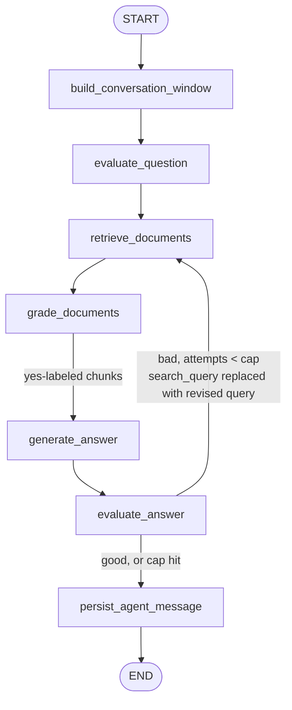

# Query Agent Component

Component 2 (`docs/architecture.md` §2.2). A LangGraph agent that answers
natural-language questions about one already-ingested repository.

Scope: single repo per Qdrant collection, multi-turn conversation.
Corrective-RAG pipeline: fixed retrieve → grade → generate → evaluate
stages, with one loop-back edge for re-retrieval.

## Graph



## Nodes

All LLM nodes run on `AGENT_MODEL` (env var).

1. **`build_conversation_window`** (not an LLM call) — turns the
   just-completed previous turn into one `conversation_window` entry
   (question, answer, and `cited_context` — the previous answer's cited
   chunks re-fetched live via `get_chunks_by_id`, §2.1, so a follow-up
   grounds in what the code says *now*), appends it, and trims to the
   most recent `CONVERSATION_WINDOW_TURNS` (env var). No-op on the first
   turn. Also formats the window into `conversation_history`, a single
   text block every other LLM node in this turn prepends to its own
   prompt, computed once here.

2. **`evaluate_question`** (LLM, structured output) — reasons about the
   question: implementation, architecture, a heuristic/design decision, a
   specific named symbol, or a workflow. Produces `synthesized_query`
   (question + any added context - this is what
   gets searched), `filters` (`language`).

3. **`retrieve_documents`** (not an LLM call) — calls `search_chunks`
   (§2.1) with `search_query` + `filters`. Hits merge into
   `retrieved_chunks`, keyed by chunk id, so a chunk returned by more
   than one attempt doesn't duplicate.

4. **`grade_documents`** (LLM, structured output, one call per
   newly-retrieved chunk) — labels each chunk not yet graded `yes`/`no`
   for relevance to the user's question. Labels persist across attempts;
   a chunk is graded once.

5. **`generate_answer`** (LLM, structured output) — question +
   `yes`-labeled chunks → `Answer` (§2.2). Each chunk shown to the model
   includes its real `chunk_id`, which the model must copy into its
   `Citation` (not invent) — `build_conversation_window` depends on that
   id being real to re-fetch the chunk later.

6. **`evaluate_answer`** (LLM, structured output) — grades the generated
   `Answer` against the *original user question* (not the retrieved
   chunks against the search query — a distinct judgment from
   `grade_documents`'s per-chunk relevance). `good` or cap hit →
   `persist_agent_message`. `bad`, under the attempt cap → loops back to
   `retrieve_documents` with `search_query` *replaced* by a new,
   standalone query the evaluator writes for the retry.

7. **`persist_agent_message`** (not an LLM call) — runs once per turn,
   after `evaluate_answer` reaches a terminal state. Appends an
   `AIMessage` built from `state.answer` to `messages` (§2.2) — the only
   node that writes to `messages` on the answer side of a turn; the
   `HumanMessage` for the question is appended by the caller before
   `graph.invoke()` (§2.3).

## 2.1 Retrieval

- **`search_chunks`** (`chunks.py`) — Qdrant Query API search. Chunks carry
  `raw_text`/`context_text` in their payload, so a hit is self-contained.
- **`get_chunks_by_id`** (`chunks.py`) — a lookup, not a search: one
  batched Qdrant `retrieve()` by chunk id.

## 2.2 Conversation & agent state

```python
class TurnContext(TypedDict):
    question: str
    answer: str
    cited_context: str  # formatted from cited chunks' context_text, "" if none cited

class AgentState(TypedDict):
    messages: Annotated[list[AnyMessage], add_messages]
    question: str
    conversation_window: list[TurnContext]
    conversation_history: str
    search_query: str
    search_filters: dict  # {"language": str}
    expects_multiple_retrievals: bool
    retrieved_chunks: dict[str, ChunkSearchResult]
    chunk_relevance: dict[str, Literal["yes", "no"]]
    retrieval_attempts: int
    answer: Answer | None
    answer_grade: Literal["good", "bad"] | None
    evaluation_reasoning: str | None
```

Only `messages` needs the `add_messages` reducer — it has two writers
across a turn (the caller's `HumanMessage`, `persist_agent_message`'s
`AIMessage`), so writes must append rather than overwrite. Every other
field has exactly one writer node that manages its own merge/trim in
plain code, so LangGraph's default overwrite-on-return is already
correct — including `conversation_window`, which persists and grows
turn over turn rather than resetting.

`Answer = {text: str, citations: list[Citation]}`. `Citation =
{chunk_id, file_path, start_line, end_line, citation_text}` —
`citation_text` is the quoted source excerpt itself, not just its
location. Each turn's answer flattens to:

```python
AIMessage(
    content=answer.text,
    additional_kwargs={"citations": [c.chunk_id for c in answer.citations]},
)
```

A checkpointer persists all of `AgentState` (explained next section).

## 2.3 Life-cycle

LangGraph's Postgres checkpointer persists all of `AgentState` per
`thread_id`, written after every node. A follow-up turn restores prior state and can
continue the conversation from a different process.

## 2.4 Constraints

- **`retrieval_attempts` cap**: each `Effort` sets its own `retrieval_attempts_cap`, checked in `graph.py`'s post-`evaluate_answer` routing.
- **`CONVERSATION_WINDOW_TURNS` cap** (env var) - bounds `conversation_window`.

## 2.5 Streaming & serving

Async end-to-end (`ainvoke`/`astream`). Serving details — the FastAPI app, endpoints, and SSE framing — are in `docs/query_agent_api_frontend.md`.