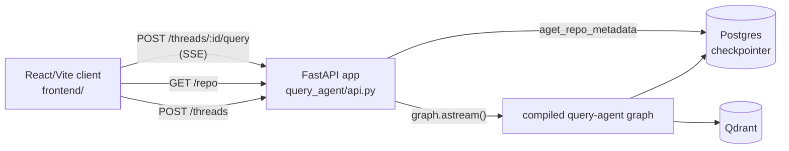

# Query Agent API & Frontend

A thin HTTP/SSE interface on top of the Query Agent (`docs/query_agent.md`):
`query_agent/api.py` (FastAPI) wraps the compiled graph, `frontend/` (Vite +
React + TypeScript) is its chat client.

Scope: single-turn-at-a-time chat against one already-ingested repo, no
conversation persistence beyond LangGraph's Postgres checkpointer, no auth.
`thread_id` lives only in client memory — a refresh starts a new
conversation.

## Architecture

Async end-to-end:
`lifespan` opens an `AsyncQdrantClient`/`AsyncConnectionPool` once, builds
the graph once onto `app.state`, and request handlers call `graph.astream(...)`.

## 1. API (`query_agent/api.py`)

FastAPI — lightweight and fast, with async views that fit an SSE response
directly, no framework weight beyond what this thin serving layer needs.
Progress is streamed stage-by-stage rather than one blocking call.

1. **`POST /threads`** — mints a `thread_id` (`uuid4`), stateless. Minted
   server-side rather than client-generated to set up future features.
2. **`GET /repo`** — `{github_url, commit_sha, updated_at}` via
   `aget_repo_metadata` (async twin of `get_repo_metadata`,
   `db_postgres.py`'s sync/async convention). 404 if not yet ingested.
3. **`POST /threads/{thread_id}/query`** — `{question, effort:
   "basic"|"medium"|"high" = "medium"}`, streams `text/event-stream`.

**SSE framing** — one frame per finished graph node
(`stream_mode="updates"`), event name is the node name itself.

An unhandled exception yields one `error` frame instead of killing the connection.

## 2. Frontend (`frontend/`, Vite + React + TypeScript)

- `types.ts` — mirrors backend request/SSE shapes.
- `api/sse.ts` — `readSseFrames`: parses `event:`/`data:` frames off a
  `fetch()` stream (used instead of `EventSource` since the endpoint is
  POST and `EventSource` is GET-only).
- `api/client.ts` — `createThread`/`getRepoMetadata`/`streamQuery` fetch
  wrappers.
- `hooks/useConversation.ts` — state machine: turns, `thread_id`, streaming status, effort.
  `newConversation` aborts the in-flight stream and resets everything, no
  page reload.
- `hooks/useRepoMetadata.ts` — fetches `/repo` once; stays `null` on
  failure so callers show a placeholder instead of an error.

**Turn lifecycle** — no `thread_id` until the first message. Effort
defaults to `"basic"` client-side and is sent explicitly every request.

**Rendering** — `react-markdown` for answer text and `.md` citations;
`react-syntax-highlighter` for code citations. `generate_answer` returns the full answer in one shot, so `AnswerText` fakes a word-by-word typewriter reveal instead. citations mount
once that reveal finishes.