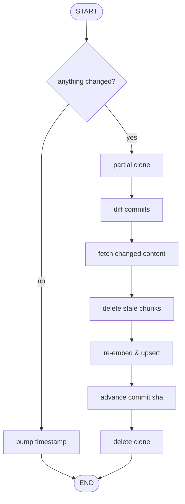

# Refresh & Sync Pipeline Component

Component 3 (`docs/architecture.md` §2.3). Keeps the Qdrant index and
Postgres's `repo_metadata` consistent with the tracked repo's `origin` as
it moves forward, without a full re-ingest. Runs as `mnrva-refresh`
(`refresh_sync.py::sync_repository`), reusing (1)'s parse/enrich/embed/
upsert functions per changed file rather than re-deriving them.

Scope: single tracked repo (matches §3.5's single-row `repo_metadata`
model). Cost scales with *what changed* between two commits, never with
total repo size — that constraint is why the pipeline never keeps a
persistent clone or checks out a working tree at all.

## Flow

If any step raises, the run aborts before `update_commit_sha` and the
clone is left on disk rather than cleaned up. Because
`commit_sha` only advances past a fully-applied diff, a retry re-diffs
from the same known-good point; chunks already upserted before the
failure stay upserted, and the next run's diff naturally covers whatever
wasn't reached.

## Steps

- **No-op check** — `get_repo_metadata` (raises if nothing's ever been
  ingested) plus `get_remote_head_sha` (`git ls-remote <url> HEAD`, zero
  clone cost). Equal shas still call `update_commit_sha` — a timestamp-only
  write, so `updated_at` reflects the last succesful sync.
- **Clone** — `clone_for_diffing`: `--filter=blob:none --no-checkout`,
  fresh every run, never persisted to disk between runs. Pulls commit/tree
  history only; file *content* is fetched on demand later. Requires the
  git host to support partial-clone filtering.
- **Diff** — `diff_since` runs `git diff --name-status --no-renames
  old_sha new_sha`. A rename surfaces as a delete+add pair.
- **Split & filter** — deleted paths vs. changed (added+modified) paths,
  both filtered through `repository_parser.passes_allowlist`. A
  changed-status path that fails the allowlist is treated as a deletion.
- **Fetch & parse** — `fetch_changed_files` batches every changed path's
  content into one `git archive` call at `new_sha`. Oversized content is dropped without parsing. Routed by extension to
  `parse_code_bytes`/`parse_prose_bytes`.
- **Delete then insert** — `delete_chunks_by_path` runs for every deleted
  *and* changed path before any upsert. A changed file's chunks are fully
  purged and re-created.
- **Enrich, embed, upsert** — one call to `enrich_embed_and_upsert`
  (`repository_ingester.py`, shared with ingestion, exported rather than
  duplicated) over every changed file's fresh parse together, reusing its
  bounded worker pool and rate limiter.
- **Commit** — `update_commit_sha` only after every path applies
  successfully; the clone directory is then deleted.

## Deployment

`mnrva-refresh` (`src/mnrva/refresh.py`, a `[project.scripts]` entry in
`pyproject.toml`) builds the Postgres pool and Qdrant client, runs
`sync_repository` against a scratch `refresh_files/` dir, prints the
`RefreshResult`, and exits non-zero on failure. It reads the `github_url`
from the `repo_metadata` row `mnrva-ingest`
already wrote. All connection config is env-driven (`POSTGRES_*`,
`QDRANT_URL`/`QDRANT_API_KEY`, `OPENAI_API_KEY`) — no
hardcoded hosts, and it fails fast if a required var is missing.

Shipped as a **reusable** GitHub Actions workflow
(`.github/workflows/refresh-reusable.yml`, `on: workflow_call`), meant to be shared
across every independent mnrva deployment:

- Installs mnrva by its pinned git tag (`uvx --from
  git+https://github.com/NaorGavriel/mnrva.git@v0.1.0 mnrva-refresh`)
  instead of checking out whichever repo calls it — no `actions/checkout`
  step, since `sync_repository` clones the *tracked* repo itself.
- Concurrency: overlapping runs on one repo queue without blocking or terminating an on-going earlier run.
- Callers pass their own secrets explicitly, each has its own Qdrant/Postgres/OpenAI.

`docs/mnrva-refresh.yml` is the copyable caller workflow for any repo that wants scheduled refresh.

## Constraints

- **Public repositories only** — a git auth path isn't implemented yet.
- **Qdrant and Postgres must be network-reachable from the runner**.
